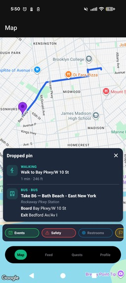
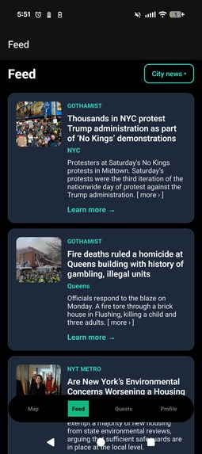
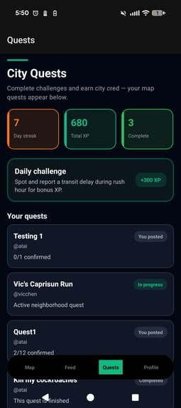

# City Pulse

**Your one-stop shop for everything NYC** — events, public safety incidents, transit
routing, and neighbor-to-neighbor favors, all on one live map.

🏆 **2nd place overall — HackMHC++** · [Live demo](https://city-pulse.web.app) · [Devpost](https://devpost.com/software/citypulse-dnapf8)

<p align="center">
  
  
  
</p>

## What it does

New Yorkers juggle half a dozen apps to get around the city. City Pulse folds them
into a single map, where every pin is colour-coded by what it is:

| Pin | Meaning |
|---|---|
| 🟢 Green | **Events** — sports, music, arts, food, community, outdoors. Tap for details plus a Gemini-generated summary. |
| 🔴 Red | **Safety incidents** — crime, traffic accidents, and fires near you. |
| 🔵 Blue | **Public bathrooms** — because you never know. |
| 🟡 Yellow | **NeighborFavors** — user-posted quests. Post a task and the number of people you need; the pin clears once enough neighbors accept. |

On top of the map:

- **Transit routing with a safety score.** Pick any destination and City Pulse returns
  public-transit routes, each rated for safety and annotated with the incidents that
  occurred along it.
- **Recommended events feed.** Browse events we think you'll like instead of hunting
  across the map.
- **City news feed.** Quick summaries of what's happening across the five boroughs.
- **Quests and XP.** Daily challenges, streaks, and city cred for contributing.

## Why we built it

We started with a narrower idea: a tool to help transit riders plan a *safer* commute —
enter a destination, get routes ranked by safety, and see recent incidents along each one.

As we built it, we realized the interesting part wasn't the safety score; it was that we'd
assembled a live picture of the city. So we widened the scope from a safety tool into a
community one — and that reframing changed how people reacted to it.

## How it works

```
NYC Open Data (SODA API) ─┐
NYPD Complaint Data (YTD) ─┤
Special Events Permits    ─┼──► Firestore ──► Expo / React Native app
User-submitted pins       ─┘                      │
                                                  ├── Google Maps  (map + directions)
                                                  └── Gemini API   (event summaries, feed enrichment)
```

**Data sources.** Safety incidents come from NYPD Complaint Data (YTD) via the NYC Open
Data SODA API; events come from the NYC Special Events Permits dataset (street fairs and
permitted public gatherings), supplemented by user-submitted events and incident reports.

**App structure.** Expo Router drives four tabs — Map, Feed, Quests, Profile — behind a
Firebase Auth flow with a preferences step. Firestore holds `events`, `communityPosts`,
`incidents`, and `transitServiceAlerts`. The same codebase ships to Android, iOS, and web.

## Tech stack

| Layer | Technology |
|---|---|
| App | Expo (SDK 54) + React Native, Expo Router, React Native Paper |
| Language | TypeScript |
| Auth & database | Firebase Auth + Firestore |
| Maps & routing | Google Maps SDK + Directions API (Apple MapKit on iOS) |
| AI | Google Gemini (event summaries, feed enrichment) |
| Open data | NYC Open Data SODA API |
| Web hosting | Firebase Hosting |

## Engineering challenges

**Keeping one UI consistent across mobile and web.** React Native Web doesn't render
everything the way native does — blur, fonts, and map layers all diverged. We ended up
bundling the vector icon fonts ourselves (`mobile/public/fonts/`) with matching
`@font-face` rules in `app/+html.tsx`, rather than relying on a CDN or Paper's indirect
icon loader, which resolved to a different package on web.

**Pin clutter.** With every dataset switched on, the map became unreadable — thousands of
pins across five boroughs. We fixed it by centering and zooming the map on the user's
current location so only nearby pins render.

**Deciding what *not* to build.** With four people and a weekend, the features we cut
helped as much as the ones we shipped. Knowing when to stop adding turned out to be the
real skill.

## Running locally

App code lives in `mobile/`.

1. Copy `mobile/.env.example` → `mobile/.env` and fill in values. **Firebase:** Web app keys from the Firebase console. **Google Maps:** set `GOOGLE_MAPS_API_KEY` in `mobile/.env` (enable Maps SDK in Google Cloud). `app.config.js` passes it into the app via `expo.extra` (no `EXPO_PUBLIC_` needed). Restart Expo after editing `.env`. **Profile** shows a masked preview. **iPhone** can use Apple MapKit without a key; **Android** needs the key for full map tiles or it uses the list fallback.

2. Install and run:

```bash
cd mobile
npm install
npm start
```

Then press `a` (Android) or `i` (iOS simulator on macOS) or scan the QR code with Expo Go.

3. Firestore seed data (from repo root):

```bash
npm install
```

You need a **service account key** (Firebase Console → Project settings → Service accounts → Generate new private key). Point the seed script at the JSON file (do not commit it):

```powershell
$env:GOOGLE_APPLICATION_CREDENTIALS="C:\full\path\to\serviceAccount.json"
npm run seed:firestore
```

Or set `FIREBASE_SERVICE_ACCOUNT` to that path in `mobile/.env` (loaded automatically). The script uses `EXPO_PUBLIC_FIREBASE_PROJECT_ID` from `mobile/.env` for the project id.

Ensure Firestore rules allow reads for the collections used by the app (`events`, `communityPosts`, `incidents`, `transitServiceAlerts`, …) for your demo.

## Publish (EAS)

Expo Application Services builds store-ready binaries.

1. Install the CLI globally or use `npx`: `npm install -g eas-cli`
2. Log in: `eas login`
3. In `mobile/`, link the project: `eas init` (creates/updates the Expo project id in `app.config.js`)
4. Android: `npm run build:prod:android` (or `preview` for an APK)
5. iOS (macOS + Apple Developer account): `npm run build:prod:ios`

Submit to stores: `npm run submit:android` / `npm run submit:ios` after you have store listings configured.

**Expo SDK:** The app targets **SDK 54** (npm `expo@54.0.6`) so it loads in **Expo Go 54.x** (e.g. client **54.0.6**). Use Node **≥ 20.19.4** if tooling warns (recommended for RN 0.81 / Metro).

**Google Play:** Android builds use **target and compile SDK 35** (Android 15), matching Play’s [target API policy](https://developer.android.com/google/play/requirements/target-sdk) for new submissions.

## Web (Firebase Hosting)

### Deploy your latest changes (web)

1. Commit or save your work; ensure `mobile/.env` has the keys you need (Firebase, Google Maps, etc.).
2. From the **repository root** (not only `mobile/`):

```bash
npm install
npx firebase login
npm run deploy:web
```

This runs `expo export -p web` into `mobile/dist`, then `firebase deploy --only hosting:city-pulse` (see `firebase.json` → **`site`: `city-pulse`**).

3. If you changed **`firestore.rules`**, deploy rules separately:

```bash
npx firebase deploy --only firestore:rules
```

4. First-time or new machine: `npx firebase login` selects the Google account with access to the Firebase project in `.firebaserc`.

### Static web assets (icons)

Vector icon fonts used by `@expo/vector-icons` / React Native Paper are copied into **`mobile/public/fonts/`** (`Ionicons.ttf`, `MaterialCommunityIcons.ttf`) so the web build does not rely on a CDN. `mobile/app/+html.tsx` declares matching `@font-face` rules; `mobile/app/_layout.tsx` still preloads the same families via `expo-font`. The floating tab bar (`components/navigation/CityPulseTabBar.tsx`) renders **Material Community Icons** via `@expo/vector-icons/MaterialCommunityIcons` so the bottom nav uses the same bundled font as the rest of the app (not Paper’s indirect icon loader, which can pick a different package on web).

In [Firebase Console](https://console.firebase.google.com/) → your project → **Hosting** → ensure a **site ID** named **`city-pulse`** exists (add another site if needed). Deploy targets that site; its URL is typically **`https://city-pulse.web.app`** when that site id is available.

`.firebaserc` sets the Firebase **project** (e.g. `citypulse-46b49`); the **hosting site** name is configured separately in `firebase.json`.

**Google Maps (web):** Google Cloud → Credentials → your Maps key → HTTP referrers → include `https://city-pulse.web.app/*` (and your project’s default `*.web.app` URL if you use it).

**Firebase Auth:** Authentication → Settings → **Authorized domains** → add the same hostnames you use in production.

## Team

Built at HackMHC++ by [Sam Strugger](https://github.com/sams222), Abdullah Zidan,
Atai Kydyrov, and Gianella Palacio.
